# InsightFlow — Intelligent Workflow Analytics & Accountability Platform

> **MCA Semester 3 Mini-Project Submission**  
> An enterprise-grade institutional workflow management, deterministic SLA tracking, and audit accountability platform.

---

## 🌟 Executive Overview

Institutional student services frequently suffer from opaque status tracking, unmonitored processing delays, and lack of accountability across departmental handoffs. 

**InsightFlow** is built from the ground up as a multi-tier institutional operating system that solves this core problem:
- **Configurable Workflows**: Services transition through department-owned workflow stages defined in the database rather than hardcoded enums.
- **Deterministic SLA Engine**: Continuous rule-based risk evaluation (`safe`, `warning`, `critical`, `breached`) where **every insight includes a human-readable explanation** rather than black-box/fake AI scores.
- **Immutable Accountability Timeline**: Append-only audit logs capturing actor, action, timestamp, stage dwell time, and administrative rationale for complete traceability.
- **Role-Aware Portals**: Dedicated workspaces for Students, Department Staff, and Institutional Administrators.

---

## 🏛️ Architectural Decisions & Enforcement Matrix

As finalized during the architectural planning phase, InsightFlow strictly adheres to the following decisions:

| Ref | Architectural Decision | Implementation & Security Enforcement |
|---|---|---|
| **Q1** | **Creation-Only Dynamic Fields** | Dynamic field schemas are configured per category (text, textarea, select, date, number, checkbox). Captured values are frozen as JSON on `ServiceRequest.dynamic_fields_data` upon creation and cannot be edited by students. |
| **Q2** | **Rejection & Terminal Paths** | `WorkflowStage` supports explicit rejection branches (e.g. *Approval → Rejected*) alongside forward progression. Rejections are permanently recorded in `AuditRecord` with mandatory administrative notes. |
| **Q3** | **Reliable In-App Notifications** | Notification model designed for in-app delivery with **60-second frontend polling**, providing high reliability and clean state management without brittle WebSockets. |
| **Q4** | **Administrative Separation of Concerns** | **Django Admin** (`/admin/`) manages institutional configuration (Departments, Workflow Definitions, Stages, SLA targets). The **React Admin Dashboard** is dedicated exclusively to **Analytics, Intelligence, Department Health, and Bottleneck Diagnostics**. |
| **Q5** | **Attachment Lifecycle Policy** | Students can upload supporting files (PDF, JPEG, PNG, DOCX up to 10MB) while a request is active. Once a request reaches a terminal status (`resolved`, `rejected`, `closed`), attachment uploads are permanently locked. |

---

## 📸 Visual Walkthrough & System Screenshots

InsightFlow features role-tailored interfaces and advanced empirical AI engines:

### 1. Institutional Authentication & Role Gateways
| Institutional Single Sign-On (SSO) |
|:---:|
| 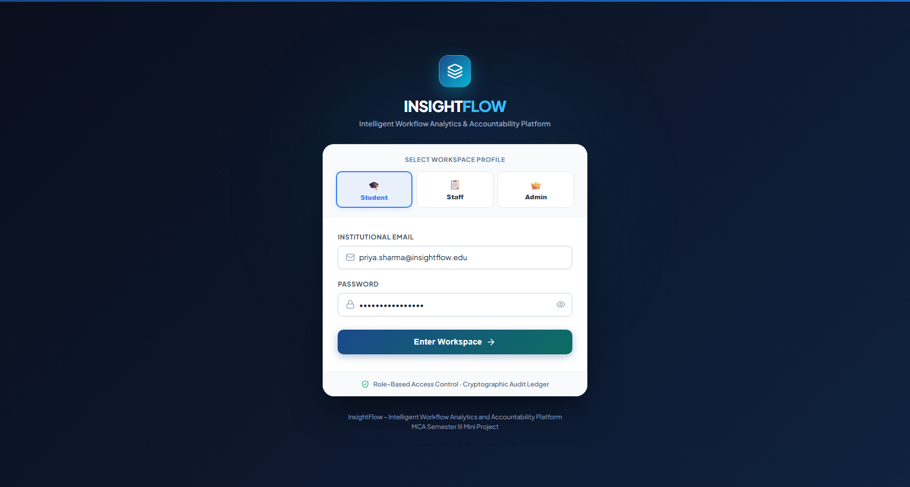 |

---

### 2. Student Experience Portal
| Student Dashboard & SLA Badges | Multi-Department Request Wizard |
|:---:|:---:|
| 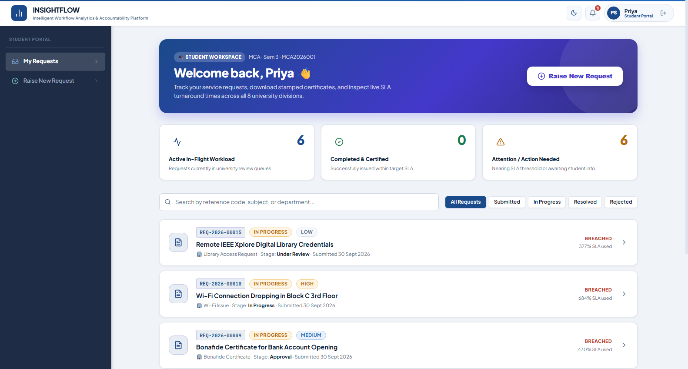 | 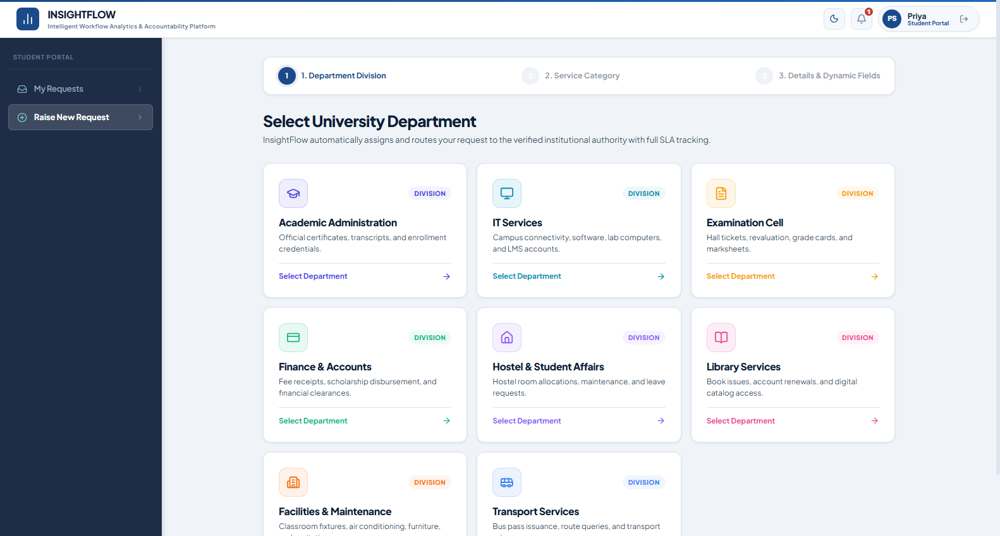 |

| Request Tracking, Deterministic ETA & SIS Clearance |
|:---:|
| 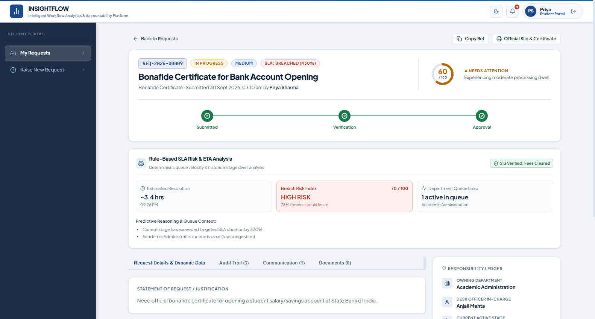 |

---

### 3. Department Staff Operations
| Departmental Active Queue | Staff Processing & Stage Progression |
|:---:|:---:|
| 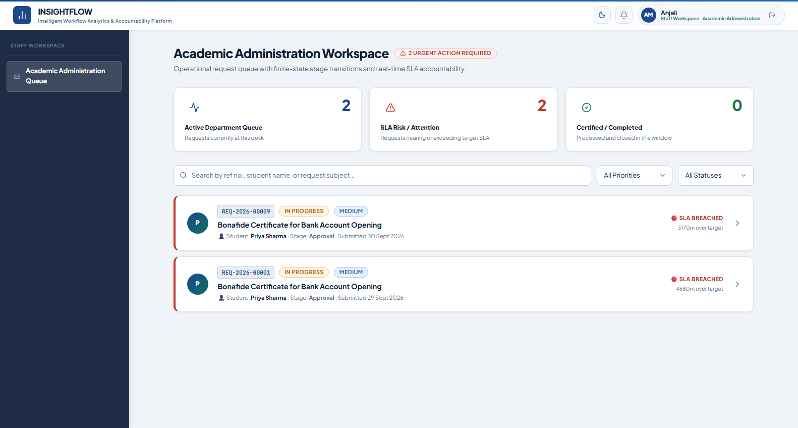 | 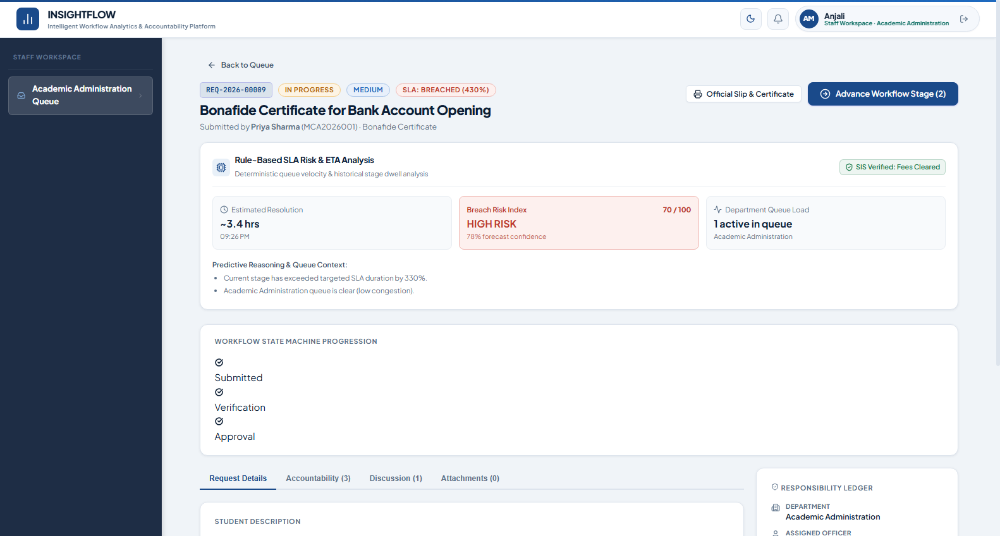 |

---

### 4. Executive Command Center & Governance
| Executive Command Center & KPIs | Department Health Matrix |
|:---:|:---:|
| 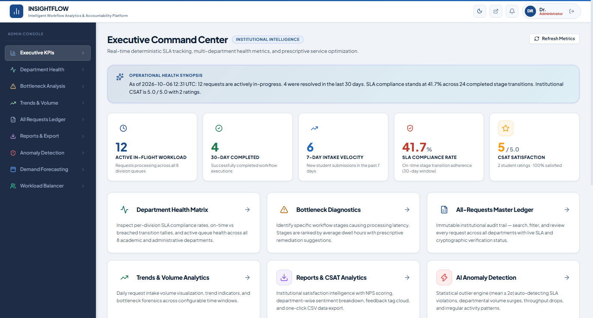 | 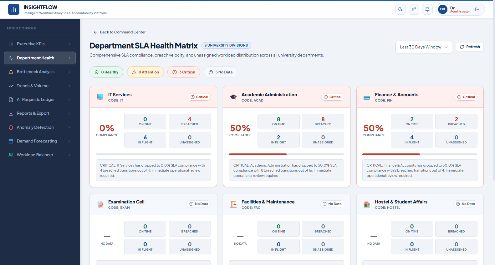 |

| Bottleneck Forensics | Intake Velocity & Trends |
|:---:|:---:|
| 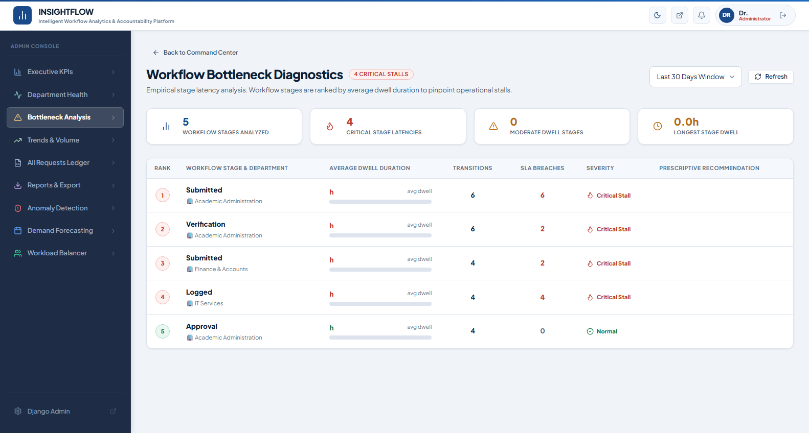 | 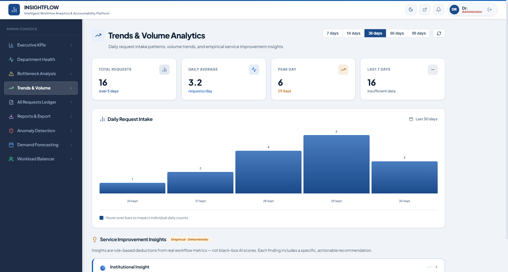 |

| Master Requests Ledger | Reports, NPS & CSAT Analytics |
|:---:|:---:|
| 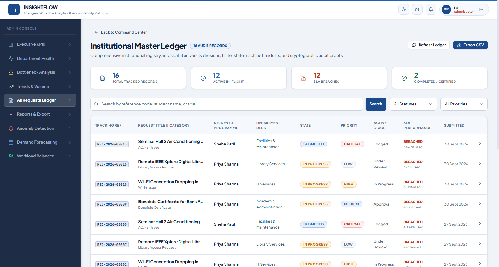 | 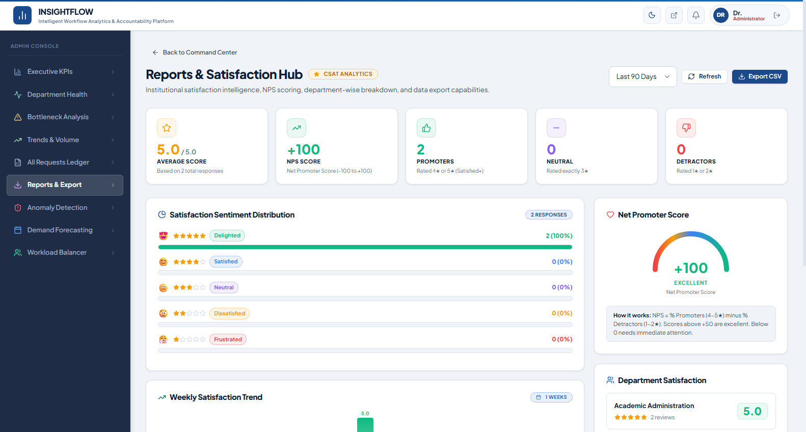 |

---

### 5. Advanced AI Intelligence & Operational Optimizers
| AI Statistical Anomaly Detection (Mean ± 2σ) | Predictive Demand Forecasting (7-14 Days) |
|:---:|:---:|
| 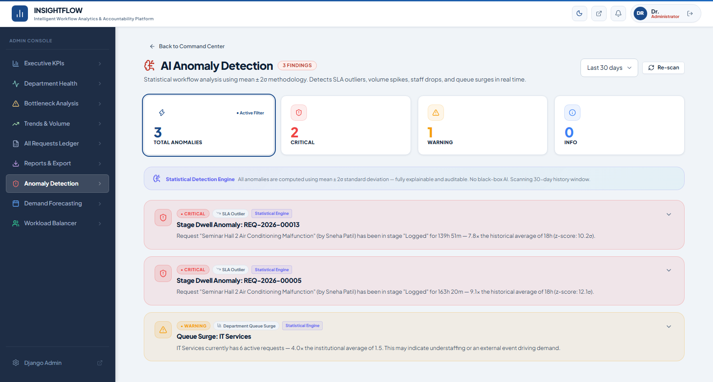 | 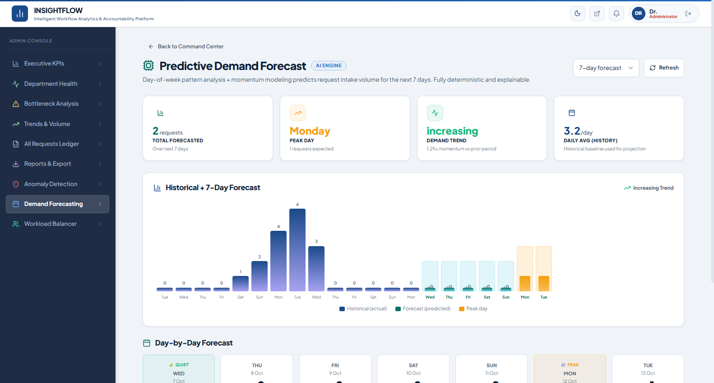 |

| Intelligent Staff Workload Balancer & Reassignment Optimizer |
|:---:|
| 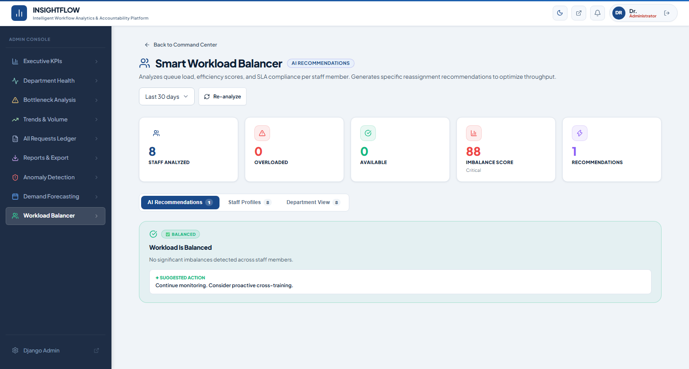 |

---

## 🛠️ Technology Stack

### Backend
- **Framework**: Django 4.2.16 & Django REST Framework 3.15.2
- **Authentication**: JWT using `djangorestframework-simplejwt` 5.3.1
- **Architecture**: Decoupled, service-oriented Python engines (`WorkflowEngine`, `SLAEngine`, `NotificationService`)
- **Database**: SQLite
- **Testing**: `pytest`, `pytest-django`, `pytest-cov`

### Frontend
- **Framework**: React 19.2.8 + Vite 8.2.2 (SPA)
- **Design System**: Vanilla CSS with custom glassmorphism design tokens, vibrant accents, dark mode palette, and CSS variables
- **Icons**: `lucide-react`
- **Routing**: `react-router-dom` 7.18.2 with role-protected route guards
- **API Communication**: Axios with automatic JWT Bearer token injection and 401 refresh interceptors

---

## 🚀 Quick Start Guide

### Prerequisites
- Python 3.10+
- Node.js 18+ and npm

---

### 1. Backend Setup & Startup

```bash
# Navigate to backend directory
cd backend

# Install dependencies
pip install -r requirements.txt

# Run migrations
python manage.py migrate

# Seed complete demo data (departments, workflows, categories, users, sample requests)
python manage.py seed_data

# Start the Django development server
python manage.py runserver 127.0.0.1:8000
```

Backend API will be live at: `http://127.0.0.1:8000/api/v1/`  
Django Admin configuration interface: `http://127.0.0.1:8000/admin/`

---

### 2. Frontend Setup & Startup

```bash
# Navigate to frontend directory
cd frontend

# Install packages
npm install

# Start Vite development server
npm run dev
```

Frontend UI will be live at: `http://localhost:5173/`

---

## 🔑 Demo Credentials

All seeded demo accounts use the standard password: **`InsightFlow@2026`**

| Role | Email | Name & Department | Purpose |
|---|---|---|---|
| 👑 **Administrator** | `admin@insightflow.edu` | Dr. Rashmi Nair (Admin) | Full Analytics, Department Health, Bottlenecks, Master Ledger |
| 👔 **Academic Staff** | `academic.staff@insightflow.edu` | Anjali Mehta (Academic Section) | Process Academic Certificate Queue, Stage Transitions, Internal Notes |
| 👔 **IT Staff** | `it.staff@insightflow.edu` | Ravi Kumar (IT Department) | Process Wi-Fi & IT Infrastructure Queue |
| 🎓 **Student** | `priya.sharma@insightflow.edu` | Priya Sharma (MCA Sem 3) | Track requests, submit new applications, post comments |
| 🎓 **Student** | `rahul.verma@insightflow.edu` | Rahul Verma (MCA Sem 3) | Multi-student isolation and cross-ownership testing |

*(Quick-login demo buttons are also available directly on the login screen for instant 1-click access during presentations!)*

---

## 🧪 Running Automated Tests

Run the backend test suite:

```bash
cd backend
pytest tests/ -v
```

### Test Suite Breakdown
- `tests/test_accounts.py`: 28 tests (JWT Auth, Login, Token Refresh, Blacklisting, Profile Isolation)
- `tests/test_permissions.py`: 10 tests (Role-Based Access Control, 401 unauthenticated guards, Response envelopes)
- `tests/test_workflows.py`: 21 tests (Stage graph constraints, SLA configurations, Service area uniqueness)
- `tests/test_requests.py`: 15 tests (Atomic transitions, Rejection paths, WorkflowEngine validation, Stage history)
- `tests/test_api_v1.py`: 17 tests (End-to-end REST API integration, Student views, Staff queues, Admin analytics)

---

## 📊 Complete API Route Reference

| Method | Endpoint | Allowed Roles | Description |
|---|---|---|---|
| `POST` | `/api/v1/auth/login/` | Public | Authenticate user & issue JWT access + refresh tokens |
| `POST` | `/api/v1/auth/logout/` | Authenticated | Blacklist refresh token |
| `POST` | `/api/v1/auth/token/refresh/` | Public | Refresh expired access token |
| `GET` | `/api/v1/auth/me/` | Authenticated | Get current authenticated user profile & role |
| `GET` | `/api/v1/service-areas/` | Authenticated | List all active institutional service domains |
| `GET` | `/api/v1/service-categories/` | Authenticated | List categories (filterable by `area_id`) |
| `GET` | `/api/v1/service-categories/{id}/` | Authenticated | Get category schema with dynamic form fields |
| `GET` | `/api/v1/requests/` | Student | List own service requests with live SLA computations |
| `POST` | `/api/v1/requests/` | Student | Submit new service request with dynamic fields |
| `GET` | `/api/v1/requests/{id}/` | Student | Get request detail, visual timeline, comments & files |
| `GET/POST`| `/api/v1/requests/{id}/comments/` | Student | View public comments or post message to staff |
| `POST` | `/api/v1/requests/{id}/attachments/` | Student | Upload supporting file (active requests only) |
| `GET` | `/api/v1/staff/queue/` | Staff, Admin | Department-scoped active request queue |
| `GET` | `/api/v1/staff/queue/{id}/` | Staff, Admin | Full request detail with allowed next stages |
| `POST` | `/api/v1/staff/queue/{id}/transition/` | Staff, Admin | Atomically advance or reject workflow stage |
| `GET/POST`| `/api/v1/staff/queue/{id}/comments/` | Staff, Admin | Post public reply or staff-only internal note |
| `POST` | `/api/v1/staff/queue/{id}/assign/` | Staff, Admin | Reassign request to another staff member |
| `GET` | `/api/v1/notifications/` | Authenticated | Get recent notifications |
| `GET` | `/api/v1/notifications/count/` | Authenticated | Polling endpoint returning unread notification count |
| `POST` | `/api/v1/notifications/mark-read/` | Authenticated | Mark notification IDs or all as read |
| `GET` | `/api/v1/admin/dashboard/` | Admin | Executive KPIs & operational health synthesis |
| `GET` | `/api/v1/admin/department-health/` | Admin | Per-department SLA compliance & breach ratings |
| `GET` | `/api/v1/admin/bottlenecks/` | Admin | Workflow stage latency analysis & remediation tips |
| `GET` | `/api/v1/admin/trends/` | Admin | Daily intake request volume trends |
| `GET` | `/api/v1/admin/requests/` | Admin | Master institutional ledger with multi-filters |

