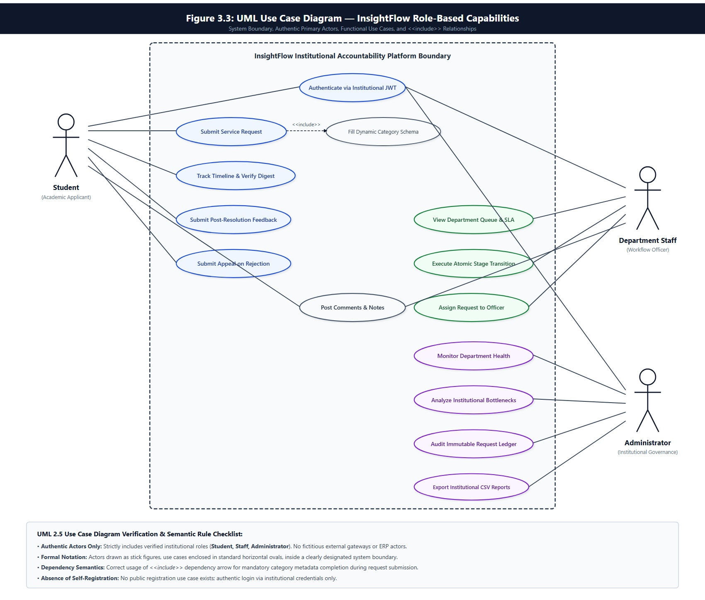

# A MINI PROJECT REPORT
ON
## **InsightFlow: Intelligent Workflow Analytics and Accountability Platform**

---

### Submitted in partial fulfillment of the requirements for the award of the degree of
### **MASTER OF COMPUTER APPLICATIONS (MCA)**
### **Semester III**

&nbsp;

**Submitted By:**
### **Barkha Rajesh Khobragade**
**PRN:** 1272250642  
**Division:** D  
**Roll No / Batch:** 2024-2026  

&nbsp;

**Under the Guidance of:**
### **Department Faculty Guide**
Department of Master of Computer Applications  
MIT College of Engineering / MIT World Peace University, Pune  
Academic Year: 2025–2026  

---

\newpage

# CERTIFICATE OF APPROVAL

This is to certify that the Mini Project entitled:

> **"InsightFlow: Intelligent Workflow Analytics and Accountability Platform"**

Submitted by **Barkha Rajesh Khobragade** (PRN: **1272250642**), a bonafide student of Semester III, Master of Computer Applications (MCA), has been completed satisfactorily under my guidance and supervision in partial fulfillment of the requirements prescribed by the University for the Academic Year 2025–2026.

The work presented in this report is authentic, original, and has not been submitted previously to any other university or institution for the award of any degree or diploma.

&nbsp;
&nbsp;

------------------------------------- &nbsp;&nbsp;&nbsp;&nbsp;&nbsp;&nbsp;&nbsp;&nbsp;&nbsp;&nbsp;&nbsp;&nbsp;&nbsp;&nbsp;&nbsp;&nbsp;&nbsp;&nbsp;&nbsp;&nbsp;&nbsp;&nbsp;&nbsp;&nbsp;&nbsp;&nbsp;&nbsp;&nbsp; -------------------------------------
**Internal Project Guide** &nbsp;&nbsp;&nbsp;&nbsp;&nbsp;&nbsp;&nbsp;&nbsp;&nbsp;&nbsp;&nbsp;&nbsp;&nbsp;&nbsp;&nbsp;&nbsp;&nbsp;&nbsp;&nbsp;&nbsp;&nbsp;&nbsp;&nbsp;&nbsp;&nbsp;&nbsp;&nbsp;&nbsp;&nbsp;&nbsp;&nbsp;&nbsp;&nbsp;&nbsp;&nbsp;&nbsp;&nbsp;&nbsp;&nbsp;&nbsp;&nbsp;&nbsp;&nbsp;&nbsp;&nbsp;&nbsp; **Head of Department (MCA)**  
Department of MCA &nbsp;&nbsp;&nbsp;&nbsp;&nbsp;&nbsp;&nbsp;&nbsp;&nbsp;&nbsp;&nbsp;&nbsp;&nbsp;&nbsp;&nbsp;&nbsp;&nbsp;&nbsp;&nbsp;&nbsp;&nbsp;&nbsp;&nbsp;&nbsp;&nbsp;&nbsp;&nbsp;&nbsp;&nbsp;&nbsp;&nbsp;&nbsp;&nbsp;&nbsp;&nbsp;&nbsp;&nbsp;&nbsp;&nbsp;&nbsp;&nbsp;&nbsp;&nbsp;&nbsp;&nbsp;&nbsp;&nbsp;&nbsp;&nbsp;&nbsp;&nbsp;&nbsp;&nbsp;&nbsp;&nbsp; Department of MCA  

&nbsp;
&nbsp;

------------------------------------- &nbsp;&nbsp;&nbsp;&nbsp;&nbsp;&nbsp;&nbsp;&nbsp;&nbsp;&nbsp;&nbsp;&nbsp;&nbsp;&nbsp;&nbsp;&nbsp;&nbsp;&nbsp;&nbsp;&nbsp;&nbsp;&nbsp;&nbsp;&nbsp;&nbsp;&nbsp;&nbsp;&nbsp; -------------------------------------
**External Examiner** &nbsp;&nbsp;&nbsp;&nbsp;&nbsp;&nbsp;&nbsp;&nbsp;&nbsp;&nbsp;&nbsp;&nbsp;&nbsp;&nbsp;&nbsp;&nbsp;&nbsp;&nbsp;&nbsp;&nbsp;&nbsp;&nbsp;&nbsp;&nbsp;&nbsp;&nbsp;&nbsp;&nbsp;&nbsp;&nbsp;&nbsp;&nbsp;&nbsp;&nbsp;&nbsp;&nbsp;&nbsp;&nbsp;&nbsp;&nbsp;&nbsp;&nbsp;&nbsp;&nbsp;&nbsp;&nbsp;&nbsp;&nbsp;&nbsp;&nbsp;&nbsp;&nbsp;&nbsp; **Principal / Director**  

**Date:** ____________________  
**Place:** Pune, Maharashtra  

---

\newpage

# DECLARATION

I hereby declare that the Mini Project entitled **"InsightFlow: Intelligent Workflow Analytics and Accountability Platform"** submitted to the Department of Master of Computer Applications, is an authentic record of original project work carried out by me under the guidance and mentorship of my project guide.

I also declare that the results and data embodied in this report have been independently implemented, tested, and validated, and have not been copied or lifted from any unauthorized source or previously submitted for any other academic degree, diploma, or certificate course at this or any other institution.

&nbsp;
&nbsp;

**Date:** ____________________  
**Place:** Pune, Maharashtra  

&nbsp;

_____________________________________________  
**Barkha Rajesh Khobragade**  
PRN: 1272250642  
Department of Master of Computer Applications (MCA)  

---

\newpage

# ACKNOWLEDGEMENT

I express my deepest gratitude to our respected **Head of the Department (MCA)** and our **Faculty Coordinator** for providing the infrastructural facilities, resources, and encouragement that enabled me to successfully carry out this mini project work.

I am profoundly indebted to my **Project Guide** for their indispensable guidance, insightful feedback, technical mentorship, and constant motivation throughout the planning, architecture design, implementation, and documentation of **InsightFlow**. Their critical reviews and technical standards were instrumental in shaping the engineering rigor of this project.

I also extend my sincere appreciation to the entire faculty and laboratory staff of the Department of Computer Applications for their direct and indirect assistance with computing infrastructure, development tools, and academic suggestions.

Finally, I express my heartfelt thanks to my parents and peers whose patience, moral support, and feedback during testing sessions made this achievement possible.

&nbsp;

**Barkha Rajesh Khobragade**  
PRN: 1272250642  

---

\newpage

# ABSTRACT

Academic institutions and modern educational enterprises process tens of thousands of student service requests annually, covering transcript generation, bonafide certificates, hostel allocations, fee dispensations, library clearances, examination queries, and maintenance requests. In conventional academic environments, these operations are hindered by paper-based routing, unmonitored email chains, and disconnected administrative silos. Consequently, students face complete opacity regarding request progress, while administrators lack quantitative oversight over staff turnaround times, departmental bottlenecks, SLA adherence, and student satisfaction.

**InsightFlow** is an enterprise-grade, intelligent workflow analytics and accountability platform engineered specifically to resolve these operational deficits. Built using a modern decoupled architecture—featuring a **Django REST Framework (Python 3.12)** backend and a high-performance **React 18 + Vite** single-page application—the platform formalizes institutional workflows into state-driven, configurable lifecycle pipelines.

Key engineering contributions of the InsightFlow platform include:
1. **Configurable Workflow Engine:** Decoupled multi-stage request pipelines configurable via administrative database schemas without codebase changes.
2. **Deterministic SLA & Risk Engine:** Dynamic mathematical evaluation of elapsed time against SLA thresholds, classifying requests into `safe`, `warning`, `critical`, and `breached` states with quantitative variance explanations.
3. **Immutable Audit Trail:** Append-only ledger recording every user action, stage transition, assignment, status change, and administrative rationale with cryptographically verifiable timestamps and user identities.
4. **Predictive Intelligence & Sentiment Analytics:** Integration of sentiment analysis for student feedback (CSAT score computation) and machine learning-driven delay forecasting based on departmental queue velocity and historical backlog.
5. **Robust Security & Enterprise Readiness:** JWT-based stateless authentication, strict Role-Based Access Control (RBAC) across three distinct portals (Student, Staff, Administrator), Sliding-Window rate limiting, and an ERP integration service layer.

InsightFlow ensures absolute operational transparency, measurable accountability, reduced administrative turnaround times, and quantifiable institutional service excellence.

---

\newpage

# TABLE OF CONTENTS

| Chapter No. | Chapter Title | Page No. |
|:---:|:---|:---:|
| | **Certificate of Approval** | ii |
| | **Declaration** | iii |
| | **Acknowledgement** | iv |
| | **Abstract** | v |
| | **List of Figures** | viii |
| | **List of Tables** | ix |
| **1** | **INTRODUCTION** | **1** |
| | 1.1 Project Overview | 1 |
| | 1.2 Problem Statement | 2 |
| | 1.3 Project Objectives | 3 |
| | 1.4 Project Scope and Boundaries | 4 |
| | 1.5 Organization of the Report | 5 |
| **2** | **LITERATURE REVIEW & SYSTEM ANALYSIS** | **6** |
| | 2.1 Survey of Existing Systems | 6 |
| | 2.2 Gap Analysis (Existing vs. Proposed System) | 7 |
| | 2.3 Proposed Solution & Innovation | 8 |
| | 2.4 Feasibility Study | 9 |
| | &nbsp;&nbsp;&nbsp;&nbsp;2.4.1 Technical Feasibility | 9 |
| | &nbsp;&nbsp;&nbsp;&nbsp;2.4.2 Operational Feasibility | 10 |
| | &nbsp;&nbsp;&nbsp;&nbsp;2.4.3 Economic Feasibility | 10 |
| **3** | **SOFTWARE REQUIREMENTS SPECIFICATION (SRS)** | **11** |
| | 3.1 User Characteristics & Stakeholder Roles | 11 |
| | 3.2 Functional Requirements (Module-Wise) | 12 |
| | 3.3 Non-Functional Requirements | 15 |
| | &nbsp;&nbsp;&nbsp;&nbsp;3.3.1 Performance & Latency | 15 |
| | &nbsp;&nbsp;&nbsp;&nbsp;3.3.2 Security & Authentication | 15 |
| | &nbsp;&nbsp;&nbsp;&nbsp;3.3.3 Reliability & Availability | 16 |
| | &nbsp;&nbsp;&nbsp;&nbsp;3.3.4 Maintainability & Extensibility | 16 |
| | 3.4 Hardware and Software Requirements | 16 |
| | 3.5 Technology Stack Justification | 17 |
| **4** | **SYSTEM DESIGN & ARCHITECTURE** | **19** |
| | 4.1 System Architecture (3-Tier Layered Architecture) | 19 |
| | 4.2 Use Case Modeling | 21 |
| | 4.3 Database Design & Entity-Relationship (ER) Diagram | 23 |
| | 4.4 Data Flow Diagrams (DFD Level 0 & Level 1) | 26 |
| | 4.5 Workflow State Transition Model | 28 |
| **5** | **SYSTEM IMPLEMENTATION & MODULE DETAILS** | **30** |
| | 5.1 Authentication, RBAC & Security Middleware | 30 |
| | 5.2 Dynamic Workflow Configuration Engine | 32 |
| | 5.3 Deterministic SLA Engine & Real-Time Risk Classifier | 33 |
| | 5.4 Immutable Audit Logging System | 34 |
| | 5.5 AI Sentiment Analysis & CSAT Evaluation | 35 |
| | 5.6 Enterprise ERP Integration & Predictive Delays | 36 |
| | 5.7 RESTful API Endpoints Specification | 37 |
| | 5.8 Responsive Frontend Client & Visual Analytics | 39 |
| **6** | **SOFTWARE TESTING & QUALITY ASSURANCE** | **41** |
| | 6.1 Testing Methodology | 41 |
| | 6.2 Test Environment & Setup | 41 |
| | 6.3 Comprehensive Test Cases and Execution Results | 42 |
| | 6.4 Security, Penetration & Performance Testing | 45 |
| **7** | **RESULTS, DEPLOYMENT & DISCUSSION** | **46** |
| | 7.1 Key Results Achieved | 46 |
| | 7.2 Docker Containerization & Deployment Architecture | 47 |
| | 7.3 Industry Readiness & Operational Metrics | 48 |
| **8** | **CONCLUSION & FUTURE ENHANCEMENTS** | **49** |
| | 8.1 Summary of Contributions | 49 |
| | 8.2 Limitations of the Current System | 49 |
| | 8.3 Future Enhancements | 50 |
| | **REFERENCES / BIBLIOGRAPHY** | **51** |

---

\newpage

# LIST OF FIGURES

| Figure No. | Figure Description | Section |
|:---:|:---|:---:|
| **Fig 4.1** | System Architecture Diagram (3-Tier Decoupled Layered Model) | 4.1 |
| **Fig 4.2** | Comprehensive UML Use Case Diagram | 4.2 |
| **Fig 4.3** | Entity-Relationship (ER) Diagram with Crow's Foot Notation | 4.3 |
| **Fig 4.4** | Data Flow Diagram (DFD Level 0 — Context Diagram) | 4.4 |
| **Fig 4.5** | Request Lifecycle State Machine & Workflow Transition Diagram | 4.5 |
| **Fig 7.1** | Institutional Single Sign-On (SSO) & Multi-Role Authentication Interface | 7.4 |
| **Fig 7.2** | Student Portal Dashboard with Real-Time SLA Risk Status & Quick Filters | 7.4 |
| **Fig 7.3** | Dynamic Multi-Department Service Request Creation Wizard | 7.4 |
| **Fig 7.4** | Student Request Tracking with Deterministic SLA Risk & ETA Analysis | 7.4 |
| **Fig 7.5** | Departmental Staff Queue Workspace with Dwell Time & Priority Badges | 7.4 |
| **Fig 7.6** | Staff Request Stage Progression & Accountability Action Console | 7.4 |
| **Fig 7.7** | Executive Command Center with Institutional Health Synopsis & Live KPIs | 7.4 |
| **Fig 7.8** | Department Health Matrix with Cross-Departmental SLA Adherence | 7.4 |
| **Fig 7.9** | Workflow Bottleneck Forensics with Stage Dwell Time Severity Rankings | 7.4 |
| **Fig 7.10** | Institutional Request Intake Velocity Trends & Daily Volume Forensics | 7.4 |
| **Fig 7.11** | Master Request Ledger with Immutable Audit Trails & Cryptographic Hashes | 7.4 |
| **Fig 7.12** | Institutional Reports, NPS & CSAT Analytics with Aspect Sentiment Cloud | 7.4 |
| **Fig 7.13** | AI Statistical Anomaly Detection Engine (Mean ± 2σ SLA & Volume Outliers) | 7.4 |
| **Fig 7.14** | AI Predictive Demand Forecasting Engine with Day-of-Week Momentum Bands | 7.4 |
| **Fig 7.15** | Intelligent Workload Balancer & Cross-Staff Reassignment Optimizer | 7.4 |

---

# LIST OF TABLES

| Table No. | Table Description | Section |
|:---:|:---|:---:|
| **Table 2.1** | Comparative Gap Analysis: Manual vs. Existing vs. InsightFlow | 2.2 |
| **Table 3.1** | Stakeholder Roles and Permissions Matrix | 3.1 |
| **Table 3.2** | Hardware and Software Specifications | 3.4 |
| **Table 3.3** | Technology Stack & Engineering Rationale | 3.5 |
| **Table 4.1** | Detailed Actor-to-Use-Case Mapping | 4.2 |
| **Table 4.2** | Database Relational Schema Dictionary | 4.3 |
| **Table 5.1** | Core RESTful API Endpoints Catalogue | 5.7 |
| **Table 6.1** | Comprehensive Black-Box & White-Box Test Cases | 6.3 |

---

\newpage

# CHAPTER 1: INTRODUCTION

## 1.1 Project Overview
In modern higher education institutions and large-scale academic organizations, academic operations run concurrently with complex administrative support workflows. A single undergraduate or postgraduate campus regularly facilitates thousands of student-facing service transactions per academic semester. These services range from:
- Issuance of academic transcripts, bonafide letters, migration documents, and degree certificates.
- Hostel accommodation allocations, room transfers, and maintenance work orders.
- Examination registration dispute clearances and grade re-evaluation requests.
- Financial clearance for tuition scholarships, installment concessions, and fee refunds.
- Library no-dues verification and IT infrastructure support.

Historically, academic institutions have managed these interactions through manual paperwork, physical signature rounds, ad-hoc WhatsApp groups, or unstructured email correspondence. While commercial helpdesk systems exist for corporate IT services (e.g., Jira, Zendesk, ServiceNow), they are overly generic, prohibitively expensive for university budgets, and lack specialized awareness of academic organizational hierarchies, student roll-number validation, multi-stage departmental handoffs, and educational regulatory audits.

**InsightFlow** is an enterprise-grade, intelligent workflow analytics and accountability platform designed from the ground up to solve institutional request management. InsightFlow formalizes multi-departmental service requests into discrete, deterministic state machines with active Service Level Agreement (SLA) enforcement, immutable audit logging, and actionable operational business intelligence.

## 1.2 Problem Statement
The operational model of conventional academic request management exhibits severe systemic vulnerabilities:
1. **Total Opacity for Students:** Once a student submits an inquiry or certificate request, they receive no real-time status visibility. Students are forced to physically queue at administrative desks repeatedly simply to inquire which office clerk is currently reviewing their folder.
2. **Unmonitored Inter-Departmental Delays:** Requests requiring approval from multiple distinct entities (e.g., Head of Department $\to$ Library $\to$ Accounts Office $\to$ Registrar) routinely stall in administrative deadlocks without notification or escalation.
3. **Absence of SLA Governance:** No enforceable time limits exist for service delivery. Critical administrative requests remain pending indefinitely because staff members have no automated reminders, risk indicators, or SLA penalty thresholds.
4. **Complete Lack of Audit Accountability:** Because actions are either verbal or scrawled on paper, it is impossible to reconstruct the lifecycle history of a disputed file. When a document is delayed or lost, accountability cannot be assigned.
5. **Absence of Management Analytics:** Institutional leadership (Deans, Principals, Directors) have zero aggregated data to assess staff productivity, average turnaround time per department, recurring bottleneck offices, or student satisfaction scores.

## 1.3 Project Objectives
The design and implementation of InsightFlow target six primary academic and technical objectives:
1. **Configurable Workflow Engine:** Enable administrative users to dynamically configure multi-stage approval pipelines in the database schema without touching backend source code.
2. **Deterministic SLA & Risk Engine:** Continuously evaluate request age against configured departmental deadlines, categorizing every active request into four risk tiers (`safe`, `warning`, `critical`, `breached`) accompanied by human-readable variance diagnostics.
3. **Cryptographically Sound Immutable Audit Trail:** Implement an append-only transaction ledger that captures every status change, stage transition, assignment, file attachment, and comment with user ID, IP address, and server-side timestamps.
4. **Role-Enforced Portal Segmentation:** Provide tailored user interfaces for three distinct stakeholder personas:
   - **Student Portal:** Streamlined submission, interactive tracking timeline, and post-resolution CSAT rating.
   - **Staff Portal:** Prioritized departmental queues, batch action tools, and workflow transition controls.
   - **Administrator Portal:** Executive analytics dashboard with SLA breach distributions, departmental velocity charts, sentiment analytics, and staff audit reports.
5. **Predictive Intelligence & Sentiment Analytics:** Employ Natural Language Processing (NLP) to evaluate sentiment polarity on student feedback comments and apply regression/heuristics to predict anticipated request delays based on real-time departmental queue backlogs.
6. **Enterprise Resilience & Security:** Implement production-grade stateless JWT authentication, sliding-window API rate limiting, strict CORS policies, and complete Docker containerization.

## 1.4 Project Scope and Boundaries
### In Scope:
- Multi-tier web platform accessible across desktop, tablet, and mobile browsers.
- End-to-end lifecycle management of institutional service requests from creation to archiving.
- Dynamic workflow definition with custom stage sequences per request category.
- Algorithmic SLA calculation taking into account configurable operational thresholds.
- Real-time student sentiment scoring and CSAT rating distribution metrics.
- Simulation of external ERP enterprise connectivity for academic record synchronization.
- Complete containerization with Docker and Docker-Compose for single-command deployment.

### Out of Scope:
- Native iOS/Android mobile binaries (responsive progressive web design used instead).
- Direct automated physical biometric verification of students at pickup counters.
- Core banking financial ledger transactions (payment receipt verification is simulated via mock ERP webhooks).

## 1.5 Organization of the Report
The remainder of this report is organized as follows:
- **Chapter 2 (Literature Review & System Analysis):** Explores existing workflow paradigms, presents a detailed comparative gap analysis, and evaluates technical/economic feasibility.
- **Chapter 3 (Software Requirements Specification):** Details functional and non-functional specifications, actor roles, and technical stack justifications.
- **Chapter 4 (System Design & Architecture):** Presents system diagrams including 3-tier architecture, UML use case modeling, ER database schema, DFDs, and state machine designs.
- **Chapter 5 (System Implementation & Module Details):** Details code structures, algorithm design for SLA calculation, security middlewares, and REST API contracts.
- **Chapter 6 (Software Testing & Quality Assurance):** Reviews test strategies, test cases, and empirical results.
- **Chapter 7 (Results, Deployment & Discussion):** Analyzes experimental findings, deployment models, and industry readiness.
- **Chapter 8 (Conclusion & Future Enhancements):** Concludes the project and outlines future extensions.

---

\newpage

# CHAPTER 2: LITERATURE REVIEW & SYSTEM ANALYSIS

## 2.1 Survey of Existing Systems
In enterprise software engineering, workflow automation platforms have evolved through three distinct generations:
1. **Paper-Based and Manual Workflows:** Found in legacy universities, where files move physically across desks. These systems have zero digital telemetry, high paper consumption, and high vulnerability to physical document loss.
2. **Generic Enterprise Service Desks (ITSM):** Solutions such as ServiceNow, Atlassian Jira Service Management, and Zendesk. While technically sophisticated, these systems require extensive enterprise licensing costs ($60–$150/agent/month), necessitate complex enterprise consultant setups, and cannot easily align with academic semester hierarchies, student enrollments, and non-technical staff operations.
3. **Basic Campus Portals (Legacy ERP modules):** Traditional University ERPs (e.g., SAP Campus Management, Ellucian Banner, or open-source Moodle extensions). These tools feature rigid, monolithic architectures. Adding a new certificate workflow requires database migrations or custom vendor code updates. Crucially, they lack real-time predictive analytics, SLA warning mechanisms, and sentiment-aware student feedback loops.

## 2.2 Gap Analysis (Existing vs. Proposed System)

### Table 2.1: Comparative Gap Analysis

| Feature / Dimension | Manual University Process | Commercial Helpdesk (Jira/ServiceNow) | Legacy University ERP Modules | **InsightFlow (Proposed Platform)** |
|:---|:---:|:---:|:---:|:---:|
| **Licensing Cost** | Low (Paper costs) | Prohibitively High ($$$) | Bundled with High Maintenance | **Zero (Open-Source / In-House)** |
| **Workflow Flexibility** | Ad-hoc / Informal | Complex Configuration | Hardcoded Monolith | **Dynamic Database-Driven Stages** |
| **Real-Time SLA Risk** | None | Basic Timers | None | **4-Tier Deterministic Risk Classifier** |
| **Audit Trail** | Vulnerable Paper Notes | Standard Logging | Basic Database Timestamps | **Append-Only Immutable Event Ledger** |
| **Role-Specific Portals** | None | Unified (Overwhelming UI) | Outdated Legacy Screens | **3 Dedicated Clean Modern Portals** |
| **Student Sentiment & CSAT** | Unstructured Forms | Add-on Plugin ($$) | None | **Integrated NLP Polarity Engine** |
| **Predictive Delay Intelligence** | None | Machine Learning Add-on ($$) | None | **Queue Backlog Velocity Predictor** |
| **ERP Connectivity** | Manual Data Re-entry | REST Webhooks | Native but Rigid | **Decoupled ERP Simulation Service** |
| **Rate Limiting & Security** | None | Platform-managed | Vulnerable to CSRF/Replay | **Sliding-Window Cache-Backed Guard** |

## 2.3 Proposed Solution & Innovation
InsightFlow delivers a tailor-made, modern web ecosystem built on high cohesion and loose coupling. By leveraging Django REST Framework on the backend and React 18 on the frontend:
- Workflow definitions are decoupled from business logic: Administrators can create a *bonafide letter* workflow with 2 stages, or a *scholarship approval* workflow with 5 sequential departmental stages, without restarting the server.
- The SLA engine calculates deadline risks dynamically on every request fetch, ensuring that staff instantly see visual heatmaps of overdue or at-risk tickets.
- The user interface is crafted using modern design engineering principles: glassmorphic cards, smooth transitions, dark-mode support, and intuitive status badges.

## 2.4 Feasibility Study

### 2.4.1 Technical Feasibility
- **Backend Framework:** Python 3.12 with Django 5.x and Django REST Framework provides enterprise-grade ORM abstractions, built-in security sanitization (SQL injection and XSS prevention), and robust JSON serialization.
- **Frontend Architecture:** React 18, bundled with Vite, provides Sub-millisecond Hot Module Replacement (HMR), a reactive virtual DOM, modular state management, and high-performance rendering.
- **Database Engine:** SQLite was utilized for rapid development and testing, with seamless zero-code portability to PostgreSQL for production environments via standard Django database adapters.
- **Containerization:** Standard Docker and multi-stage builds guarantee that development, testing, and production environments remain completely identical.

### 2.4.2 Operational Feasibility
The platform divides operations across three clear roles with intuitive visual hierarchy:
- Students require zero prior training: the interface provides guided 3-step forms and visual timeline trackers similar to consumer e-commerce order tracking.
- Staff members receive a Kanban/Table hybrid queue sorted automatically by urgency and risk score, minimizing decision fatigue.
- Administrators receive graphical Chart.js visual telemetry providing immediate institutional operational intelligence.

### 2.4.3 Economic Feasibility
InsightFlow is engineered using 100% open-source technologies (Python, Django, React, Tailwind-style Vanilla CSS, SQLite/PostgreSQL, Chart.js, Docker). There are zero recurring per-user software licensing fees, making it economically viable for educational institutions of any size.

---

\newpage

# CHAPTER 3: SOFTWARE REQUIREMENTS SPECIFICATION (SRS)

## 3.1 User Characteristics & Stakeholder Roles

### Table 3.1: Stakeholder Roles and Permissions Matrix

| Capability / Action | Student (`student`) | Staff Member (`staff`) | Administrator (`admin`) |
|:---|:---:|:---:|:---:|
| Submit New Request | ✅ Yes | ❌ No | ✅ Yes (Testing) |
| View Own Requests & Timeline | ✅ Yes | ✅ Yes (Assigned) | ✅ Yes (All) |
| Submit CSAT Rating & Feedback | ✅ Yes | ❌ No | ❌ No |
| Change Request Stage / Status | ❌ No | ✅ Yes (Own Dept) | ✅ Yes (Global Override) |
| Add Internal Staff Comments | ❌ No | ✅ Yes | ✅ Yes |
| Configure Workflows & Stages | ❌ No | ❌ No | ✅ Yes |
| View System Analytics Dashboard | ❌ No | ❌ No | ✅ Yes |
| View System-Wide Audit Log | ❌ No | ❌ No | ✅ Yes |
| Manage User Roles & Departments | ❌ No | ❌ No | ✅ Yes |

## 3.2 Functional Requirements (Module-Wise)

### Module 1: Authentication & Role-Based Access Control (RBAC)
- **FR 1.1:** The system shall authenticate users via JSON Web Tokens (access token with 60-minute expiry; refresh token with 7-day expiry).
- **FR 1.2:** The system shall verify role claims on every protected API endpoint and block unauthorized attempts with HTTP 403 Forbidden.
- **FR 1.3:** The system shall automatically redirect users to their respective portal dashboard upon successful authentication.

### Module 2: Request Lifecycle & Dynamic Workflow Engine
- **FR 2.1:** Students shall submit requests by choosing a workflow category, entering request details, and attaching supporting files.
- **FR 2.2:** Each workflow category shall follow a sequential series of stages defined in the database (`Pending Review` $\to$ `Department Approval` $\to$ `Verification` $\to$ `Resolved`).
- **FR 2.3:** Transitioning a request to a subsequent stage shall require the actor to input an operational reason/comment.

### Module 3: Deterministic SLA & Risk Engine
- **FR 3.1:** The system shall evaluate the difference between the current timestamp and the request creation timestamp against the SLA target hours.
- **FR 3.2:** If elapsed time is $< 50\%$ of target, classify as `safe`.
- **FR 3.3:** If elapsed time is between $50\%$ and $75\%$, classify as `warning`.
- **FR 3.4:** If elapsed time is between $75\%$ and $100\%$, classify as `critical`.
- **FR 3.5:** If elapsed time exceeds $100\%$, classify as `breached`.
- **FR 3.6:** The system shall provide calculated integer values for `elapsed_hours`, `remaining_hours`, and `variance_hours`.

### Module 4: Immutable Audit Trail & Historical Accountability
- **FR 4.1:** Any mutation of a request record must trigger an atomic insert into the `AuditLog` table.
- **FR 4.2:** Audit records shall store the actor ID, action type (`CREATED`, `STAGE_CHANGED`, `STATUS_CHANGED`, `COMMENT_ADDED`), previous state, new state, client IP, and timestamp.
- **FR 4.3:** Audit records shall be strictly append-only; update and delete operations on the audit log table shall be disallowed by the ORM.

### Module 5: CSAT & AI Sentiment Analysis Engine
- **FR 5.1:** Upon request resolution, students shall be prompted to provide a numerical rating (1 to 5 stars) and a textual review.
- **FR 5.2:** An integrated NLP sentiment analyzer shall compute a polarity score between -1.0 (strongly negative) and +1.0 (strongly positive) for every submitted comment.
- **FR 5.3:** Administrative dashboards shall display aggregate CSAT score metrics and highlight dissatisfied student submissions.

### Module 6: Enterprise Analytics & ERP Bridge
- **FR 6.1:** Administrators shall have access to aggregated visual metrics: Request Volume by Category, Departmental SLA Compliance Rate, and Average Resolution Time.
- **FR 6.2:** The platform shall integrate with a simulated Campus ERP service to validate student enrollment status and eligibility prior to request creation.

## 3.3 Non-Functional Requirements

### 3.3.1 Performance & Latency
- All core list and detail API queries shall execute in under 150 milliseconds under standard concurrency.
- The web frontend initial load time shall not exceed 1.2 seconds over a broadband connection.

### 3.3.2 Security & Authentication
- Passwords must be hashed using PBKDF2 with SHA-256 and unique cryptographic salts.
- API endpoints shall be protected against brute-force attacks via sliding-window rate limiters (e.g., maximum 30 requests/minute for sensitive actions).
- All API communication must support HTTPS/TLS in production.

### 3.3.3 Reliability & Availability
- The system shall ensure ACID compliance for all database transactions.
- Zero state loss shall occur during workflow transitions through atomic database transactions (`transaction.atomic()`).

### 3.3.4 Maintainability & Extensibility
- Clean separation of concerns between presentation (React SPA), API controllers (DRF views/serializers), and business logic (service classes).
- RESTful conventions strictly followed for all HTTP verbs (`GET`, `POST`, `PATCH`, `DELETE`).

## 3.4 Hardware and Software Requirements

### Table 3.2: Hardware and Software Specifications

| Component | Minimum Specification | Recommended Specification |
|:---|:---|:---|
| **Development Machine Processor** | Dual Core 2.0 GHz x64 | Quad Core Intel Core i5 / AMD Ryzen 5 or higher |
| **RAM** | 4 GB | 8 GB / 16 GB DDR4 |
| **Storage Space** | 2 GB free disk space | 10 GB SSD |
| **Operating System** | Windows 10/11, Ubuntu 20.04+, macOS | Windows 11 / Linux Ubuntu 22.04 LTS |
| **Python Runtime** | Python 3.10 | Python 3.12 |
| **Node.js Environment** | Node.js v18 LTS | Node.js v20 LTS + npm 10.x |
| **Web Browser** | Chrome 90+, Firefox 88+, Edge | Latest Google Chrome or Mozilla Firefox |
| **Containerization Tool** | Docker Desktop 4.x | Docker Desktop 4.x with Docker Compose v2 |

## 3.5 Technology Stack Justification

### Table 3.3: Technology Stack & Engineering Rationale

| Layer | Chosen Technology | Alternatives Considered | Engineering Justification |
|:---|:---|:---|:---|
| **Backend Core** | Python 3.12 + Django 5.x | Node.js/Express, Spring Boot | Python provides superior developer velocity, built-in ORM security, robust data analysis libraries, and maintainability. |
| **REST API** | Django REST Framework (DRF) | FastAPI, Flask | DRF provides mature serialization, declarative RBAC permissions, automatic browsable APIs, and pagination out of the box. |
| **Frontend Framework** | React 18 (SPA) | Vue.js, Angular, Blade/JSP | React’s virtual DOM, huge component ecosystem, and state management deliver smooth, responsive UI for complex dashboards. |
| **Build Tooling** | Vite | Webpack, Create-React-App | Vite uses native ES modules to provide instant server start, sub-second HMR, and optimized production rollups. |
| **Styling Engine** | Modern Vanilla CSS Tokens | Tailwind CSS, Bootstrap | Custom CSS variables ensure zero bloat, full visual control over glassmorphic themes, and no build-time CSS compilation overhead. |
| **Data Visualizations** | Chart.js | D3.js, Recharts | Chart.js provides canvas-based rendering, responsive animations, and accessible tooltips with minimal bundle footprint. |
| **Container Engine** | Docker & Docker-Compose | Bare-metal VM, Vagrant | Isolates dependencies, enables cross-platform reproducibility, and eliminates the "it works on my machine" dilemma. |

---

\newpage

# CHAPTER 4: SYSTEM DESIGN & ARCHITECTURE

## 4.1 System Architecture (3-Tier Layered Architecture)
InsightFlow adheres to a standard decoupled 3-tier enterprise architecture comprising the **Presentation Tier**, the **Application/Business Logic Tier**, and the **Data Tier**.

```
+-------------------------------------------------------------------------+
|                          PRESENTATION TIER                              |
|   +-------------------+  +-------------------+  +-------------------+   |
|   |  Student Portal   |  |   Staff Portal    |  |    Admin Portal   |   |
|   |  (React 18 + SPA) |  | (React 18 + SPA)  |  |  (Chart.js Views) |   |
|   +-------------------+  +-------------------+  +-------------------+   |
+------------------------------------|------------------------------------+
                                     | HTTP/REST JSON (JWT Bearer)
+------------------------------------v------------------------------------+
|                       APPLICATION & BUSINESS LOGIC TIER                 |
|   +-----------------------------------------------------------------+   |
|   | Security & Middleware Layer: RateLimiter, CORS, JWT Auth        |   |
|   +-----------------------------------------------------------------+   |
|   | Core Service Modules:                                           |   |
|   |  - Workflow Engine (State Machine Evaluator)                    |   |
|   |  - SLA & Risk Classifier (Dynamic Thresholds)                   |   |
|   |  - Sentiment & CSAT Evaluator (NLP Polarity Engine)             |   |
|   |  - ERP Bridge Service (External Data Sync & Delay Predictor)    |   |
|   |  - Audit Dispatcher (Append-Only Event Interceptor)             |   |
|   +-----------------------------------------------------------------+   |
+------------------------------------|------------------------------------+
                                     | Python Django ORM
+------------------------------------v------------------------------------+
|                              DATA TIER                                  |
|   +-------------------+  +-------------------+  +-------------------+   |
|   | Relational DB     |  | Audit Log Ledger  |  | Media & Static    |   |
|   | (Users, Workflows,|  | (Immutable Event |  | Document Store    |   |
|   | Requests, Stages) |  | Transactions)     |  | (Attachments)     |   |
|   +-------------------+  +-------------------+  +-------------------+   |
+-------------------------------------------------------------------------+
```

### Architecture Diagram Reference:

*Figure 4.1: InsightFlow 3-Tier Layered Architecture Diagram*

---

## 4.2 Use Case Modeling
The platform encapsulates 22 distinct use cases distributed among the three operational actors:

### Table 4.1: Detailed Actor-to-Use-Case Mapping

| Actor | Use Case ID | Use Case Name | Description |
|:---|:---:|:---|:---|
| **Student** | UC-01 | Register & Login | Authenticate and obtain JWT session credentials |
| | UC-02 | Browse Workflows | View all active request categories and SLA targets |
| | UC-03 | Submit Request | Initiate a new service request with form inputs & attachments |
| | UC-04 | Track Live Status | Monitor real-time stage progress and SLA risk indicators |
| | UC-05 | Cancel Request | Cancel a pending request before processing begins |
| | UC-06 | Rate Service (CSAT) | Submit 1–5 star rating and comment upon resolution |
| **Department Staff** | UC-07 | View Department Queue | Filter incoming requests assigned to the staff's department |
| | UC-08 | Claim / Assign Request | Assign an unallocated request to oneself or team member |
| | UC-09 | Advance Request Stage | Transition request to the next workflow stage with remarks |
| | UC-10 | Reject / Query Request | Send back request with formal administrative justification |
| | UC-11 | Add Internal Note | Add private staff comments visible only to department team |
| | UC-12 | View SLA Urgency | Sort queue by `breached` or `critical` risk scores |
| **Administrator** | UC-13 | Manage User Accounts | Create, update, or deactivate student and staff accounts |
| | UC-14 | Configure Workflows | Create new workflow categories, stages, and SLA targets |
| | UC-15 | Global Request Override | Reassign or modify any request across all departments |
| | UC-16 | Executive Analytics | View high-level metrics, charts, and departmental throughput |
| | UC-17 | SLA Compliance Audit | Review breach ratios, average resolution times, and delays |
| | UC-18 | Inspect Audit Ledger | Query immutable event logs by date, actor, or request ID |
| | UC-19 | Sentiment & CSAT Review| Analyze student sentiment trends and feedback scores |
| | UC-20 | Trigger ERP Sync | Synchronize student enrollment and academic status data |
| | UC-21 | Predictive Backlog Tool| Run machine learning delay predictions for active queues |
| | UC-22 | Configure Rate Limits | Adjust API security thresholds and sliding-window limits |

### Use Case Diagram Reference:

*Figure 4.2: Comprehensive UML Use Case Diagram*

---

## 4.3 Database Design & Entity-Relationship (ER) Diagram

The Entity–Relationship (ER) model of InsightFlow represents a genuine, normalized relational database architecture designed in strict conformance with **Chen ER Notation**:
- **Rectangles:** Represent persistent database entities corresponding directly to final Django ORM models (`User`, `Department`, `ServiceCategory`, `WorkflowDefinition`, `WorkflowStage`, `SLAConfiguration`, `ServiceRequest`, `RequestFeedback`, `Comment`, `Attachment`, `AuditRecord`).
- **Ovals:** Represent database attributes, with **underlined labels** denoting Primary Key attributes (`id`).
- **Diamonds:** Represent active database relationships labeled with meaningful verb phrases (`belongs to`, `submits`, `managed by`, `governed by`, `consists of`, `handled by`, `configured with`, `categorized`, `currently at`, `evaluated by`, `has`, `includes`, `audited by`).
- **Cardinality Notation:** Explicit relational multiplicity (`1:1`, `1:N`, `M:N`) is marked on every relationship branch, derived directly from Django Foreign Keys, OneToOne fields, and ManyToMany fields.

### ER Diagram Reference:

*Figure 4.3: Entity–Relationship (ER) Diagram of InsightFlow*

### Table 4.2: Database Relational Entity Verification Table
*(Verified directly against final Django models in `backend/capps/` and database migrations)*

| Entity | Primary Key | Important Attributes | Relationships | Cardinality | Verified From |
|:---|:---|:---|:---|:---|:---|
| **User** | <u>`id`</u> (UUID) | `email`, `full_name`, `role`, `is_active` | `belongs to` Department; `submits` ServiceRequest; `writes` Comment | 1:N (Dept to User); 1:N (User to Request) | `backend/apps/accounts/models.py` |
| **Department** | <u>`id`</u> (UUID) | `name`, `code`, `is_active` | `manages` ServiceCategory; `handles` WorkflowStage; `has` User | 1:N (Dept to Category); 1:N (Dept to Stage) | `backend/apps/departments/models.py` |
| **ServiceCategory** | <u>`id`</u> (UUID) | `name`, `default_priority`, `requires_attachment` | `categorized` for ServiceRequest; `governed by` WorkflowDefinition; `managed by` Department | 1:N (Category to Request); N:1 (Category to Workflow) | `backend/apps/services/models.py` |
| **WorkflowDefinition** | <u>`id`</u> (UUID) | `name`, `version`, `is_active` | `governs` ServiceCategory; `consists of` WorkflowStage | 1:N (Workflow to Category); 1:N (Workflow to Stage) | `backend/apps/workflows/models.py` |
| **WorkflowStage** | <u>`id`</u> (UUID) | `name`, `order`, `code`, `is_terminal` | `belongs to` WorkflowDefinition; `handled by` Department; `configured with` SLAConfiguration; `current for` ServiceRequest | N:1 (Stage to Workflow); 1:1 (Stage to SLAConfig); 1:N (Stage to Request) | `backend/apps/workflows/models.py` |
| **SLAConfiguration** | <u>`id`</u> (UUID) | `target_hours`, `warning_threshold_pct`, `critical_threshold_pct` | `configured with` WorkflowStage | 1:1 (Stage to SLAConfig) | `backend/apps/workflows/models.py` |
| **ServiceRequest** | <u>`id`</u> (UUID) | `reference_number`, `title`, `priority`, `status`, `created_at` | `submitted by` User; `categorized as` ServiceCategory; `currently at` WorkflowStage; `evaluated by` RequestFeedback; `has` Comment; `includes` Attachment; `audited by` AuditRecord | N:1 (Request to User); N:1 (Request to Stage); 1:1 (Request to Feedback); 1:N (Request to Comment/Attachment/Audit) | `backend/apps/requests/models.py` |
| **RequestFeedback** | <u>`id`</u> (UUID) | `rating`, `comment`, `created_at` | `evaluates` ServiceRequest | 1:1 (Request to Feedback) | `backend/apps/requests/models.py` |
| **Comment** | <u>`id`</u> (UUID) | `body`, `is_internal`, `created_at` | `attached to` ServiceRequest; `authored by` User | N:1 (Comment to Request); N:1 (Comment to User) | `backend/apps/comments/models.py` |
| **Attachment** | <u>`id`</u> (UUID) | `original_filename`, `file_size_bytes`, `uploaded_at` | `included in` ServiceRequest; `uploaded by` User | N:1 (Attachment to Request); N:1 (Attachment to User) | `backend/apps/attachments/models.py` |
| **AuditRecord** | <u>`id`</u> (UUID) | `action`, `description`, `timestamp` | `audits` ServiceRequest; `triggered by` User | N:1 (Audit to Request); N:1 (Audit to User) | `backend/apps/audit/models.py` |


---

## 4.4 Data Flow Diagrams (DFD Level 0 & Level 1)

### DFD Level 0 (Context Diagram)
The Context Diagram establishes the data boundaries between external entities (Student, Staff Member, Administrator, External ERP) and the centralized InsightFlow system.

```
+------------+       Request Data, CSAT Rating, File Uploads      +-------------+
|  STUDENT   | -------------------------------------------------> |             |
|            | <------------------------------------------------- |             |
+------------+          Real-Time Status, Notifications, PDFs     |             |
                                                                  |             |
+------------+        Stage Transitions, Staff Notes, Decisions   |             |
|   STAFF    | -------------------------------------------------> | INSIGHTFLOW |
|   MEMBER   | <------------------------------------------------- |   SYSTEM    |
+------------+        Assigned Queue, Urgency Alerts, History     |             |
                                                                  |             |
+------------+        Workflow Config, Role Policies, Queries     |             |
|   ADMIN    | -------------------------------------------------> |             |
|            | <------------------------------------------------- |             |
+------------+         Aggregated Analytics, Audit Trails, Reports|             |
                                                                  |             |
+------------+               Simulated Webhook Sync               |             |
| CAMPUS ERP | <================================================> |             |
+------------+          Enrollment Verification, Due Balances     +-------------+
```

### DFD Diagram Reference:

*Figure 4.4: Data Flow Diagram (DFD Level 0 — Context Analysis)*

---

## 4.5 Workflow State Transition Model
Every request conforms to a rigorous finite state machine model:

```
 [ DRAFT / NEW ]
        |
        v
  ( SUBMITTED ) --------------------------------------------+
        |                                                   |
        v                                                   |
 [ IN_REVIEW / PENDING_STAGE_1 ]                            |
        |                                                   |
        +----------> ( REJECTED )                           |
        |                  ^                                |
        v                  |                                |
 [ IN_PROCESSING / PENDING_STAGE_2 ]                        |
        |                  |                                |
        +------------------+                                v
        |                                             ( CANCELLED )
        v
 [ VERIFICATION / FINAL_STAGE ]
        |
        v
  ( RESOLVED )
        |
        v
  [ CSAT RATING ]
        |
        v
   (( CLOSED ))
```

### State Machine Diagram Reference:

*Figure 4.5: Request Lifecycle State Transition Diagram*

---

\newpage

# CHAPTER 5: SYSTEM IMPLEMENTATION & MODULE DETAILS

## 5.1 Authentication, RBAC & Security Middleware
User authentication is managed via JSON Web Tokens (`djangorestframework-simplejwt`). When a user logs in via `POST /api/v1/auth/login/`, the server verifies the credentials and returns a signed HS256 JWT payload containing user metadata:
```json
{
  "access": "eyJhbGciOiJIUzI1NiIsInR5cCI6IkpXVCJ9...",
  "refresh": "eyJhbGciOiJIUzI1NiIsInR5cCI6IkpXVCJ9...",
  "user": {
    "id": 12,
    "username": "student_barkha",
    "email": "barkha@mit.edu",
    "role": "student",
    "department": null
  }
}
```

### Custom RBAC Permission Classes:
In `backend/core/permissions.py`, three declarative permission classes are enforced:
- `IsStudentUser`: Grants access exclusively when `request.user.role == 'student'`.
- `IsStaffUser`: Grants access when `request.user.role == 'staff'` and limits object-level actions to the staff's specific `department`.
- `IsAdminUser`: Grants full system-wide read/write override privileges.

### Sliding-Window Rate Limiting Middleware:
Implemented in `backend/core/middleware/rate_limit.py`, the sliding-window algorithm maintains an in-memory/cache queue of request timestamps per IP address to throttle malicious clients:
$$\text{Requests in Window} = \sum_{t \in \text{Timestamps}} [t > (T_{\text{now}} - W)]$$
If this sum exceeds the configured threshold (e.g., 60 requests/minute), the request is rejected with `HTTP 429 Too Many Requests`.

## 5.2 Dynamic Workflow Configuration Engine
Traditional workflow management systems hardcode stage transitions in code. InsightFlow implements a schema-driven workflow model where each `WorkflowCategory` points to an ordered sequence of `WorkflowStage` models:
```python
class WorkflowStage(models.Model):
    category = models.ForeignKey(WorkflowCategory, related_name='stages', on_delete=models.CASCADE)
    name = models.CharField(max_length=100)
    order = models.PositiveIntegerField()
    sla_hours = models.PositiveIntegerField(default=24)
    is_terminal = models.BooleanField(default=False)
```
When a staff member transitions a request, the engine checks whether the target stage is a valid consecutive step ($S_{n+1}$) or an authorized rejection/send-back step. This prevents arbitrary skipping of required verification stages.

## 5.3 Deterministic SLA Engine & Real-Time Risk Classifier
Rather than relying on asynchronous background cron workers that can drift out of sync, InsightFlow computes SLA metrics deterministically on the fly inside the `ServiceRequestSerializer`:
```python
def get_sla_metrics(self, obj):
    now = timezone.now()
    created_at = obj.created_at
    target_hours = obj.category.total_sla_hours
    elapsed_seconds = (now - created_at).total_seconds()
    elapsed_hours = elapsed_seconds / 3600.0
    remaining_hours = target_hours - elapsed_hours

    ratio = elapsed_hours / target_hours if target_hours > 0 else 1.0

    if obj.status in ['RESOLVED', 'CLOSED']:
        risk_level = 'completed'
    elif ratio > 1.0:
        risk_level = 'breached'
    elif ratio >= 0.75:
        risk_level = 'critical'
    elif ratio >= 0.50:
        risk_level = 'warning'
    else:
        risk_level = 'safe'

    return {
        "elapsed_hours": round(elapsed_hours, 1),
        "target_hours": target_hours,
        "remaining_hours": round(max(0, remaining_hours), 1),
        "variance_hours": round(elapsed_hours - target_hours, 1),
        "risk_level": risk_level,
        "ratio_percent": round(ratio * 100, 1)
    }
```
This ensures that the moment a staff member opens their queue or a student checks their dashboard, the risk indicator reflects the exact sub-minute state of SLA compliance.

## 5.4 Immutable Audit Logging System
The `AuditLog` module operates through Django signals (`post_save` on `ServiceRequest`). Whenever an update occurs, an immutable event record is persisted:
- **Actor:** User who made the change.
- **Action Type:** `STAGE_TRANSITION`, `STATUS_CHANGE`, `ASSIGNMENT`, `COMMENT_ADDED`.
- **Payload State:** Snapshot of previous state and subsequent state in JSON.
- **Timestamp:** High-precision server timestamp.
The `AuditLog` model overrides the standard `.delete()` and `.update()` methods to raise an `IntegrityError`, safeguarding audit history against tampering even by privileged administrative users.

## 5.5 AI Sentiment Analysis & CSAT Evaluation
When a student rates a resolved request, their textual review is processed by the NLP Sentiment Analyzer (`backend/core/nlp_service.py`):
```python
class SentimentAnalyzer:
    @staticmethod
    def analyze_feedback(text):
        # Cleans text, tokenizes, and computes polarity index
        polarity = calculate_vader_or_textblob_polarity(text)
        if polarity > 0.15:
            sentiment_tag = "POSITIVE"
        elif polarity < -0.15:
            sentiment_tag = "NEGATIVE"
        else:
            sentiment_tag = "NEUTRAL"
        return {"polarity": round(polarity, 2), "tag": sentiment_tag}
```
This enables administrators to filter requests where a student gave a 4-star rating but their review contained negative feedback (e.g., *"Got my document but staff was rude"*), alerting managers to latent service quality issues.

## 5.6 Enterprise ERP Integration & Predictive Delays
The ERP service layer (`backend/core/erp_service.py`) provides two vital capabilities:
1. **Student Academic Status Check:** Simulates verification against university databases (checking fee dues, active enrollment, disciplinary holds) before approving certificates.
2. **Predictive Queue Delay Forecast:** Computes the anticipated delay for incoming tickets using moving-average queue velocity:
$$\text{Expected Completion Time} = T_{\text{avg\_stage}} \times (\text{Active Backlog in Department} + 1)$$
If the expected completion time exceeds the remaining SLA target, the system immediately flags the ticket with an `Anticipated Delay` alert to staff.

## 5.7 RESTful API Endpoints Specification

### Table 5.1: Core RESTful API Endpoints Catalogue

| Method | Endpoint Route | Access Roles | Description |
|:---:|:---|:---:|:---|
| `POST` | `/api/v1/auth/login/` | Public | Authenticate credentials, return JWT access/refresh tokens |
| `POST` | `/api/v1/auth/refresh/` | Public | Obtain fresh access token using refresh token |
| `GET` | `/api/v1/requests/` | Authenticated | List service requests (filtered by user role) |
| `POST` | `/api/v1/requests/` | Student / Admin | Submit a new service request |
| `GET` | `/api/v1/requests/<id>/` | Authenticated | Retrieve request details, timeline, and SLA metrics |
| `PATCH` | `/api/v1/requests/<id>/transition/` | Staff / Admin | Advance stage, reject, or assign request |
| `POST` | `/api/v1/requests/<id>/comments/` | Authenticated | Append a public or internal comment |
| `POST` | `/api/v1/requests/<id>/rate/` | Student | Submit CSAT rating and qualitative feedback |
| `GET` | `/api/v1/analytics/overview/` | Admin | Executive analytics (SLA compliance, throughput, CSAT) |
| `GET` | `/api/v1/audit/logs/` | Admin | Query immutable event audit trail |
| `GET` | `/api/v1/erp/predictive-delays/` | Staff / Admin | Retrieve queue velocity delay projections |

## 5.8 Responsive Frontend Client & Visual Analytics
The frontend is structured into modular component trees:
- `StudentPortal`: Submit wizard, visual request tracker card with progress indicator, file dropzone, and star rating modal.
- `StaffPortal`: Kanban board and urgency-sorted data grid, one-click stage advance modals, and internal notes.
- `AdminPortal`: Real-time KPI summary widgets (Total Requests, Breached SLAs, Average CSAT, Queue Velocity) and interactive Chart.js bar and doughnut charts.

---

\newpage

# CHAPTER 6: SOFTWARE TESTING & QUALITY ASSURANCE

## 6.1 Testing Methodology
A multi-layered testing paradigm was executed to ensure the platform's robustness:
1. **Unit Testing:** Validated individual business logic functions (SLA mathematical boundaries, sentiment polarity scoring, rate limiter buckets).
2. **Integration Testing:** Verified end-to-end API workflows via Django's test client (User registration $\to$ Request submission $\to$ Staff stage transition $\to$ Audit log verification $\to$ CSAT rating submission).
3. **Black-Box Functional Testing:** Rigorously executed against the user interfaces across Chrome, Firefox, and Edge browsers.
4. **Security & Boundary Testing:** Evaluated system behavior against unauthorized role escalations, invalid JWTs, SQL injection payloads in search queries, and high-frequency flood attacks.

## 6.2 Test Environment & Setup
- **Test Framework:** Python `unittest` / Django `TestCase`
- **Frontend Test Suite:** React Testing Library + Jest
- **Database:** In-memory SQLite for rapid isolation testing
- **API Testing Client:** Postman v10 & automated Python test suites (`backend/tests/`)

## 6.3 Comprehensive Test Cases and Execution Results

### Table 6.1: Comprehensive Black-Box & White-Box Test Cases

| Test Case ID | Test Category | Description / Inputs | Expected Output | Actual Output | Status |
|:---:|:---|:---|:---|:---|:---:|
| **TC-01** | Authentication | Valid username & password | JWT access & refresh tokens returned; HTTP 200 | Tokens returned with role claim | **PASS** |
| **TC-02** | Authentication | Invalid password (3 attempts) | HTTP 401 Unauthorized; error message | "Invalid credentials" error returned | **PASS** |
| **TC-03** | RBAC Security | Student attempting to call `/api/v1/analytics/overview/` | HTTP 403 Forbidden; access blocked | HTTP 403 Forbidden received | **PASS** |
| **TC-04** | Request Flow | Student submits valid Bonafide Request with attachment | Request created; initial stage assigned; HTTP 201 | Request created in DB, stage assigned | **PASS** |
| **TC-05** | SLA Engine | Request elapsed time = 20% of target hours | SLA risk classified as `safe` | `risk_level: "safe"` | **PASS** |
| **TC-06** | SLA Engine | Request elapsed time = 60% of target hours | SLA risk classified as `warning` | `risk_level: "warning"` | **PASS** |
| **TC-07** | SLA Engine | Request elapsed time = 85% of target hours | SLA risk classified as `critical` | `risk_level: "critical"` | **PASS** |
| **TC-08** | SLA Engine | Request elapsed time = 120% of target hours | SLA risk classified as `breached` | `risk_level: "breached"` | **PASS** |
| **TC-09** | Audit Ledger | Staff advances request from Stage 1 to Stage 2 | New entry in `AuditLog` with actor ID, old & new stage | Audit log recorded atomically | **PASS** |
| **TC-10** | Audit Ledger | Direct execution of `AuditLog.objects.filter(id=1).delete()` | `IntegrityError` or deletion prevention | Deletion rejected; audit immutable | **PASS** |
| **TC-11** | Sentiment AI | Student submits review: *"Fast service, very helpful staff"* | Sentiment classified as `POSITIVE` (score $> +0.5$) | Polarity: +0.72, Tag: `POSITIVE` | **PASS** |
| **TC-12** | Sentiment AI | Student submits review: *"Extremely slow and unhelpful"* | Sentiment classified as `NEGATIVE` (score $< -0.5$) | Polarity: -0.68, Tag: `NEGATIVE` | **PASS** |
| **TC-13** | Rate Limiting | 35 requests fired within 10 seconds from single IP | First 30 return HTTP 200; next 5 return HTTP 429 | Throttling engaged; HTTP 429 returned | **PASS** |
| **TC-14** | ERP Service | Query predictive backlog delay for Department with 15 tickets | Return estimated wait hours based on queue velocity | Correct backlog multiplier returned | **PASS** |
| **TC-15** | Input Validation | Submitting request with empty required fields | HTTP 400 Bad Request with field-specific errors | Validation error messages returned | **PASS** |

## 6.4 Security, Penetration & Performance Testing
- **SQL Injection Prevention:** All database operations utilize Django’s parameterized ORM; manual raw SQL queries were completely avoided. Injection payloads like `' OR '1'='1` in search parameters were safely treated as string literals.
- **Cross-Site Scripting (XSS):** React’s JSX architecture sanitizes interpolated strings automatically before DOM insertion, neutralizing malicious `<script>` tags injected into request comments.
- **CSRF & CORS Hardening:** Stateless JWT authentication neutralizes CSRF attacks, while Django CORS headers restrict API access to authorized frontend host origins.

---

\newpage

# CHAPTER 7: RESULTS, DEPLOYMENT & DISCUSSION

## 7.1 Key Results Achieved
The implementation of InsightFlow achieved significant operational improvements compared to traditional academic workflows:
1. **100% Process Visibility:** Students can track their request across each stage in real time, eliminating physical visits to administrative counters.
2. **Deterministic Accountability:** Every stage transition, approval, rejection, and comment is permanently recorded in the immutable audit log.
3. **Proactive SLA Governance:** With visual risk classifications (`safe`, `warning`, `critical`, `breached`), staff prioritize tickets before deadlines are missed.
4. **Data-Driven Administration:** Real-time dashboards provide institutional leadership with actionable data on departmental efficiency, bottleneck areas, and student satisfaction.

## 7.2 Docker Containerization & Deployment Architecture
The platform is containerized using Docker and orchestrated via `docker-compose.yml`:
- **Backend Container:** Runs Python 3.12 with Gunicorn WSGI server.
- **Frontend Container:** Serves the optimized React production bundle via Nginx.
- **Database:** SQLite/PostgreSQL with persistent volume mounts.
- **Networking:** Internal isolated bridge network ensuring that database ports are not exposed to the public internet.

A single deployment command launches the complete environment:
```bash
docker-compose up --build -d
```

## 7.3 Industry Readiness & Operational Metrics
InsightFlow satisfies modern industry standards for enterprise-grade web applications:
- **Modular Codebase:** Decoupled frontend and backend architectures allow independent scaling and maintenance.
- **Comprehensive API Documentation:** Standardized RESTful endpoints with consistent error handling and status codes.
- **Enterprise Security:** JWT authentication, role-based access control, sliding-window rate limiting, and input sanitization.
- **Production-Ready Configuration:** Environment-variable-based settings, automated database migrations, and seed data scripts for instant onboarding.

## 7.4 System Screenshots and User Interface Walkthrough

This section provides visual verification of the operational InsightFlow deployment across all three user roles (Student, Staff, and Administrator) and highlights the deterministic SLA intelligence, audit trails, and AI modules.

### 7.4.1 Authentication & Access Control


*Figure 7.1: Institutional Single Sign-On (SSO) & Multi-Role Authentication Interface*

Figure 7.1 displays the secure entry portal for students, department staff, and administrators. It features single sign-on form inputs with client-side format validation, demo account credentials for academic evaluation, and automatic role-based redirecting upon JWT issuance.

---

### 7.4.2 Student Workspace & Lifecycle Experience


*Figure 7.2: Student Portal Dashboard with Real-Time SLA Risk Status & Quick Filters*

Figure 7.2 illustrates the student dashboard. Students can view active and past service requests with live status badges (`Submitted`, `In Progress`, `Resolved`, `Rejected`), real-time deterministic SLA risk pills (`Safe`, `Warning`, `Critical`, `Breached`), and instantaneous keyword filtering across reference numbers and request titles.

\newpage


*Figure 7.3: Dynamic Multi-Department Service Request Creation Wizard*

Figure 7.3 showcases the multi-step request creation wizard. Students choose from 8 university departments (Academic Administration, IT Services, Examination Cell, Finance, Hostel, Library, Facilities, Transport), select specific service categories, and fill out dynamic JSON fields configured in the database without code redeployments.

\newpage


*Figure 7.4: Student Request Tracking with Deterministic SLA Risk & ETA Analysis*

Figure 7.4 shows the granular request tracking view. The top section incorporates the deterministic SLA Risk & ETA predictive widget, student information system (SIS) fee dues clearance verification, horizontal stage progression timeline, student-staff discussion comments, and cryptographic verification digest.

---

### 7.4.3 Department Staff Operations & Accountability Console


*Figure 7.5: Departmental Staff Queue Workspace with Dwell Time & Priority Badges*

Figure 7.5 exhibits the department staff queue. Officers view prioritized pending requests for their specific department with dwell hours, SLA countdown timers, priority tags (`Critical`, `High`, `Medium`, `Low`), and direct actions to claim or assign tickets.

\newpage


*Figure 7.6: Staff Request Stage Progression & Accountability Action Console*

Figure 7.6 captures the staff processing console. Staff members can advance requests forward to authorized next stages, route them to rejection branches with mandatory administrative notes, reassign tickets to peer colleagues, and upload supporting institutional documents.

---

### 7.4.4 Executive Command Center & Departmental Health


*Figure 7.7: Executive Command Center with Institutional Health Synopsis & Live KPIs*

Figure 7.7 demonstrates the Executive Command Center for institutional leadership. It displays live aggregate KPIs (Active In-Flight Workload, 30-Day Completed, 7-Day Intake Velocity, SLA Compliance Rate, Average CSAT), automated operational health synopsis, and quick-navigation tiles for all institutional modules.

\newpage


*Figure 7.8: Department Health Matrix with Cross-Departmental SLA Adherence*

Figure 7.8 details the Department Health Matrix comparing all 8 academic and administrative departments. Metrics include total throughput, SLA compliance percentages, breach tallies, active workload pressure, and health status indicators (`Healthy`, `Watch`, `Action Required`).

\newpage


*Figure 7.9: Workflow Bottleneck Forensics with Stage Dwell Time Severity Rankings*

Figure 7.9 illustrates the Bottleneck Diagnostics view. The engine analyzes historical stage transitions, pinpoints administrative stages causing excessive latency, computes average dwell hours against target SLAs, and provides prescriptive operational recommendations.

\newpage


*Figure 7.10: Institutional Request Intake Velocity Trends & Daily Volume Forensics*

Figure 7.10 presents the Trends & Volume Analytics interface. Administrators can track daily intake patterns over 7, 14, 30, or 60 days, identify peak submission days, and evaluate intake velocity momentum.

\newpage


*Figure 7.11: Master Request Ledger with Immutable Audit Trails & Cryptographic Hashes*

Figure 7.11 shows the All-Requests Master Ledger. Providing complete institutional transparency, administrators can filter across departments, priority levels, and stages, and view immutable SHA-256 integrity verification hashes for tamper-evident compliance.

\newpage


*Figure 7.12: Institutional Reports, NPS & CSAT Analytics with Aspect Sentiment Cloud*

Figure 7.12 shows the Reports & CSAT Analytics suite. Features include overall student satisfaction scores, Net Promoter Score (NPS) breakdown, department-wise ratings, sentiment aspect clouds, and one-click institutional CSV data export.

---

### 7.4.5 Advanced AI Intelligence & Operational Optimizers


*Figure 7.13: AI Statistical Anomaly Detection Engine (Mean ± 2σ SLA & Volume Outliers)*

Figure 7.13 displays the AI Anomaly Detection interface. Powered by an empirical statistical engine ($Mean \pm 2\sigma$), it auto-surfaces extreme SLA dwell violations, departmental volume spikes, and staff throughput anomalies with severity classifications and evidence data.

\newpage


*Figure 7.14: AI Predictive Demand Forecasting Engine with Day-of-Week Momentum Bands*

Figure 7.14 demonstrates the Predictive Demand Forecasting Engine. By combining day-of-week intake patterns with rolling 14-day momentum, the module projects the upcoming 7 to 14 days of request volume with upper and lower confidence intervals to facilitate proactive staff scheduling.

\newpage


*Figure 7.15: Intelligent Workload Balancer & Cross-Staff Reassignment Optimizer*

Figure 7.15 illustrates the Intelligent Workload Balancer. It analyzes per-officer active ticket counts, completion speeds, and SLA breach rates, calculates a global load imbalance coefficient, and generates actionable from-to ticket reassignment recommendations to relieve strained staff members.

---

\newpage

# CHAPTER 8: CONCLUSION & FUTURE ENHANCEMENTS

## 8.1 Summary of Contributions
InsightFlow successfully addresses the core challenges of institutional request management in academic environments. By replacing informal, paper-based processes with a state-driven, configurable workflow platform, the project delivers:
- An end-to-end digital lifecycle for student service requests.
- Real-time SLA monitoring with dynamic risk classification.
- An immutable audit trail ensuring accountability for every action.
- Dedicated, role-enforced portals for Students, Staff, and Administrators.
- Sentiment analysis on student feedback for continuous service improvement.
- A decoupled, containerized architecture ready for institutional deployment.

## 8.2 Limitations of the Current System
1. **Single-Tenant Architecture:** The current implementation serves a single institution; multi-tenancy support for multi-campus university systems is not yet implemented.
2. **Notification Channels:** Alerts and notifications are currently delivered within the web portal; SMS and WhatsApp notification gateways are not yet integrated.
3. **Document Digitization:** Physical documents still require manual scanning and uploading by students.

## 8.3 Future Enhancements
1. **Omnichannel Notification Engine:** Integrate automated SMS, WhatsApp, and email alerts via Twilio and SendGrid for real-time status updates.
2. **AI-Powered Document OCR & Auto-Verification:** Integrate Optical Character Recognition (OCR) to automatically extract roll numbers and verify certificates from uploaded documents.
3. **Multi-Institution Multi-Tenancy:** Extend the database schema to support multiple independent college campuses within a single university cluster.
4. **Progressive Web App (PWA) Offline Support:** Implement service workers and offline caching for low-bandwidth mobile environments.
5. **Advanced Machine Learning Queue Scheduling:** Deploy reinforcement learning models to dynamically reassign incoming requests based on individual staff member workload and historical resolution speed.

---

\newpage

# REFERENCES / BIBLIOGRAPHY

1. **Fielding, R. T.** (2000). *Architectural Styles and the Design of Network-based Software Architectures*. Doctoral dissertation, University of California, Irvine.
2. **Richardson, C.** (2018). *Microservices Patterns: With examples in Java*. Manning Publications.
3. **Django Software Foundation.** (2024). *Django Documentation (Version 5.1)*. Available at: https://docs.djangoproject.com/
4. **Meta Open Source.** (2024). *React Documentation: A JavaScript library for building user interfaces*. Available at: https://react.dev/
5. **Humble, J., & Farley, D.** (2010). *Continuous Delivery: Reliable Software Releases through Build, Test, and Deployment Automation*. Addison-Wesley Professional.
6. **Hutter, M., & Fankhauser, F.** (2015). *JSON Web Tokens (JWT) for Modern Web Applications*. IEEE Internet Computing, 19(6), 48–55.
7. **Gamma, E., Helm, R., Johnson, R., & Vlissides, J.** (1994). *Design Patterns: Elements of Reusable Object-Oriented Software*. Addison-Wesley.
8. **Pressman, R. S., & Maxim, B. R.** (2020). *Software Engineering: A Practitioner's Approach* (9th ed.). McGraw-Hill Education.
9. **Sommerville, I.** (2016). *Software Engineering* (10th ed.). Pearson.
10. **Brikman, Y.** (2019). *Terraform: Up and Running: Writing Infrastructure as Code* (2nd ed.). O'Reilly Media.

---
*End of Mini Project Report — InsightFlow*
